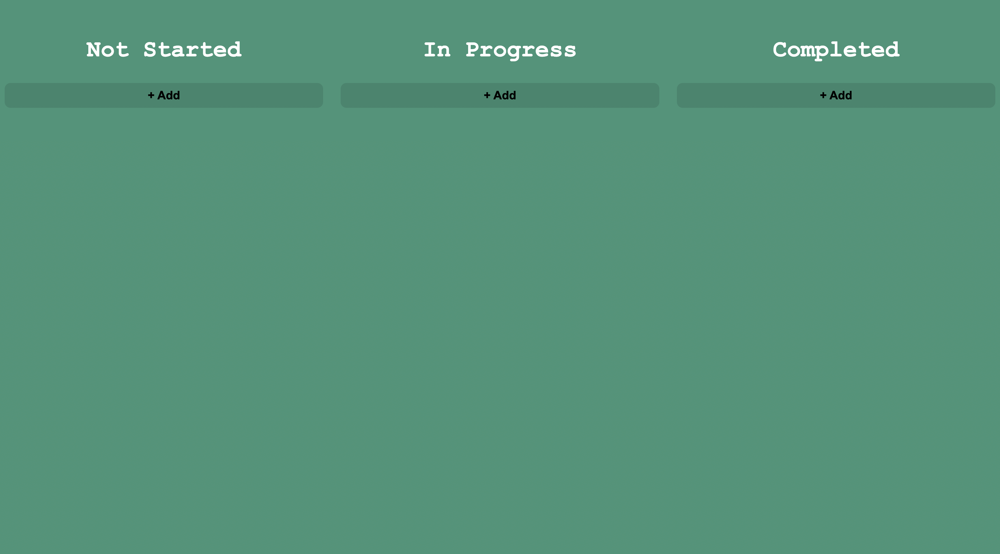

<h1 align="center">Kanban Board Application</h1>

      A modern and interactive Kanban board for managing tasks and improving workflow efficiency. 

  <h3>
    <a href="https://ahmedsmaha.github.io/Kanban-Board">
      Demo
    </a>
  </h3>

## Table of Contents

- [Overview](#overview)
  - [What I learned](#what-i-learned)
  - [Useful resources](#useful-resources)
- [Built with](#built-with)
- [Features](#features)
- [Acknowledgements](#acknowledgements)
- [Author](#author)

## Overview

The **Kanban Board Application** is a dynamic and responsive tool for organizing and managing tasks. It includes drag-and-drop functionality, customizable columns, and real-time updates, making it an essential tool for teams or individual productivity.

### What I learned

- Structuring an application using semantic HTML and modular CSS.
- Implementing drag-and-drop functionality using JavaScript.
- Advanced CSS techniques:
  - Flexbox and Grid for intuitive layouts.
  - CSS transitions for smooth drag effects.
- Enhancing user experience through clean UI/UX design principles.

### Useful resources

- [Drag and Drop API - MDN Web Docs](https://developer.mozilla.org/en-US/docs/Web/API/HTML_Drag_and_Drop_API) - A comprehensive guide to implementing drag-and-drop functionality.
- [CSS Tricks - Flexbox Guide](https://css-tricks.com/snippets/css/a-guide-to-flexbox/) - Helped me align board columns and tasks effectively.
- [JavaScript Info](https://javascript.info/) - Useful for learning advanced JavaScript concepts.

### Built with

- Semantic HTML5 markup
- CSS custom properties
- Flexbox & CSS Grid
- JavaScript

## Features

- **Drag-and-Drop Tasks**: Intuitive drag-and-drop functionality to move tasks between columns.
- **Customizable Columns**: Add, rename, or remove columns to fit your workflow.
- **Responsive Design**: Optimized for desktop, tablet, and mobile devices.
- **Persistent Data**: Saves board state locally for seamless user experience.

## Acknowledgements

- [Font Awesome](https://fontawesome.com/) - Used for app-related icons.
- [Google Fonts](https://fonts.google.com/) - Typography for the landing page.

## Author

- Website [ahmedsmaha.github.io/ahmedsmaha](https://ahmedsmaha.github.io/ahmedsmaha)
- GitHub [@ahmedsmaha](https://github.com/ahmedsmaha)
